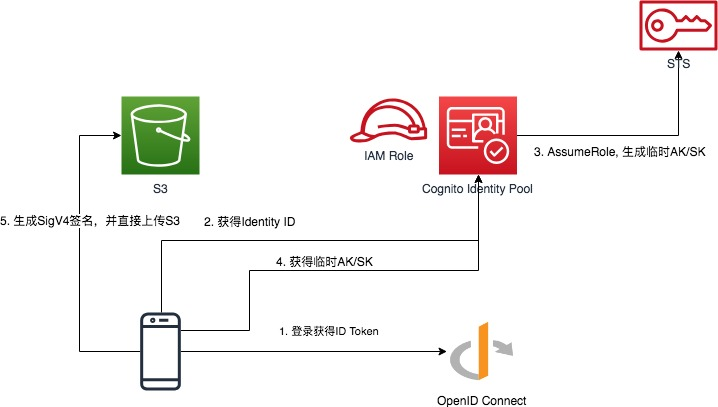

# S3, Cognito, OpenID Connect Lab

本文介绍如何使用Cognito Identity Pool 对接 OpenID Connect, 实现用户只能上传和查看自己的文件。

S3 是一个对象存储服务，非常适合存储海量文件。它不仅支持从服务器端上传/下载 S3 中的内容，同时允许客户从客户端
直接上传/下载 S3 中的资源。

在实际应用过程中，我们经常遇到这样的需求：只允许用户 上传/下载/删除/修改(CRUD) 自己的文件。本人将探讨
利用 Cognito Identity Pool, OpenID Connect 实现精细化权限控制，限制用户只能访问自己的文件。


## 前提

1. 本文将使用 [Auth0](https://auth0.com) 作为用户库。请注册 Auth0 账户，
并添加 **application**。 这并不要求用户一定使用 Auth0, 只要是
支持 [OpenID Connect](https://openid.net/connect/) 标准的用户库都可以使用次方法。

2. 本文架构部署使用 [**terraform**](https://www.terraform.io/) 一键部署AWS 资源，
请在本机安装 terraform, 并配置好[AWS Credentials](https://docs.aws.amazon.com/cli/latest/userguide/cli-configure-files.html)

3. Demo 包含前端 Web 应用，使用 yarn 做依赖管理，请自行安装 [**yarn**](https://yarnpkg.com/en/)

4. 客户需要了解 OpenID Connect 的基本机制，包括 **Access Token**, **ID Token**.


## 架构和原理



上图是这个方案的实现原理和流程, 其中**步骤3** 是 Cognito 自动去 STS 申请临时AK/SK, 该步骤对用户不可见。


1. 客户端向 OpenID Connect Provider 发起登录请求，获得accessToken 和 ID Token

```shell
http://localhost:3000/callback#
access_token=<access_token>&
expires_in=7200& 
token_type=Bearer& 
state=vaXfc.jDtU5sr37K75QRw.~ZI4E5uLDA&
id_token=<id_token>
```

如上，服务器在授权返回如上信息。其中包含 **id_token**.


2. 通过携带 ID Token 调用API, 获得用户在 Cognito Identity Pool 中的 **Identity ID**.

```shell
POST https://cognito-identity.{region}.amazonaws.com.cn/
HEADER
    X-Amz-Target: AWSCognitoIdentityService.GetId
BODY
{
    "IdentityPoolId":"<cognito-identity-pool-id>",
    "Logins":{
        "<openid-connect-provider-domain>":"<id_token>"
    }
}
```
Cognito Identity Pool返回该用户的 Identity ID.
```shell
{
    "IdentityId": "<identity-id>"
}
```

该用户在下一次调用这个接口的时候，会返回相同的 Identity ID.

3. Cognito Identity Pool 调用 STS 服务，生成临时 AK/SK. 

4. 通过 **Identity ID** 和 **ID Token** 换取该用户的临时 **AK/SK**

```shell
POST https://cognito-identity.{region}.amazonaws.com.cn/
Header
    X-Amz-Target: AWSCognitoIdentityService.GetCredentialsForIdentity
BODY
{
    "IdentityId":"<identity-id>",
    "Logins":{
        "<openid-connect-provider-domain>":"<id_token>"
    }
}
```

5. 通过 AK/SK 完成 SigV4 签名，然后直接上传文件到S3.


我们在Cognito Identity Pool 配置 Authenticated Role 的权限，生成的临时AK/SK 具有该 Role 所对应的权限。

该 Role 所具有的 Policy 配置如下, 将其中的 **<s3-bucket-name>** 和 **<app-name>** 替换为实际使用的值。
**${cognito-identity.amazonaws.com:sub}** 是一个变量，其实际内容为该用户在 Cognito Identity Pool 中的 **Identity ID**

```json
{
    "Version": "2012-10-17",
    "Statement": [
        {
            "Sid": "ListYourObjects",
            "Effect": "Allow",
            "Action": "s3:ListBucket",
            "Resource": [
                "arn:aws-cn:s3:::<s3-bucket-name>"
            ],
            "Condition": {
                "StringLike": {
                    "s3:prefix": [
                        "cognito/<app-name>/${cognito-identity.amazonaws.com:sub}"
                    ]
                }
            }
        },
        {
            "Sid": "ReadWriteDeleteYourObjects",
            "Effect": "Allow",
            "Action": [
                "s3:GetObject",
                "s3:PutObject",
                "s3:DeleteObject"
            ],
            "Resource": [
                "arn:aws-cn:s3:::<s3-bucket-name>/cognito/<app-name>/${cognito-identity.amazonaws.com:sub}",
                "arn:aws-cn:s3:::<s3-bucket-name>/cognito/<app-name>/${cognito-identity.amazonaws.com:sub}/*"
            ]
        }
    ]
}
```
在Role 中配置如上的策略，便可以实现用户只允许上传/下载/删除/列出 自己的文件。

> Policy 中的 cognito 关键字不能缺少或更改，必须为小写 **cognito**


## Demo 部署

Step 0: 注册 Auth0 帐号，并添加 Application. 详细步骤请查看 Auth0 操作手册。请注意，此处不强制使用 Auth0, 
只要是 OpenID Connect Provider 皆可。

Step 1: 在 [IAM Identity Provider](https://console.amazonaws.cn/iam/home#/providers) 中输入 **Provider URL**
和 **Audience** (该字段为 Auth0 中的 **clientID**)。

Step 2: 在 **terraform/variables.tf** 中修改变量的值。

Step 3: 通过Terraform 自动化部署 Cognito 及相关 IAM Role 
```shell
cd terraform
terraform init
terraform apply
```

Step 4: 在项目根目录下安装 Web 依赖, 
```shell
cd ..
yarn install
```

Step 5: 运行前端程序 
```
yarn start
```

Step 6: 程序正常运行，登录后，选择文件，并上传.

> 如果该系统部署在 AWS Global Region, 请务必将 IAM Policy 中的 `aws-cn` 改成 `aws`, 
> Cognito 的 endpoint 修改为 https://cognito-identity.{region}.amazonaws.com/


该解决方案也支持符合使用 SAML 标准的 Auth 系统。详细内容请
参考 [SAML Identity Providers](https://docs.aws.amazon.com/cognito/latest/developerguide/saml-identity-provider.html)

## 参考资料

[OpenID](https://docs.aws.amazon.com/cognito/latest/developerguide/open-id.html)
[Auth0 配置](https://auth0.com/docs/integrations/integrating-auth0-amazon-cognito-mobile-apps)
[JS S3 上传示例代码](https://docs.aws.amazon.com/cognito/latest/developerguide/getting-credentials.html#getting-credentials-1.javascript
)
